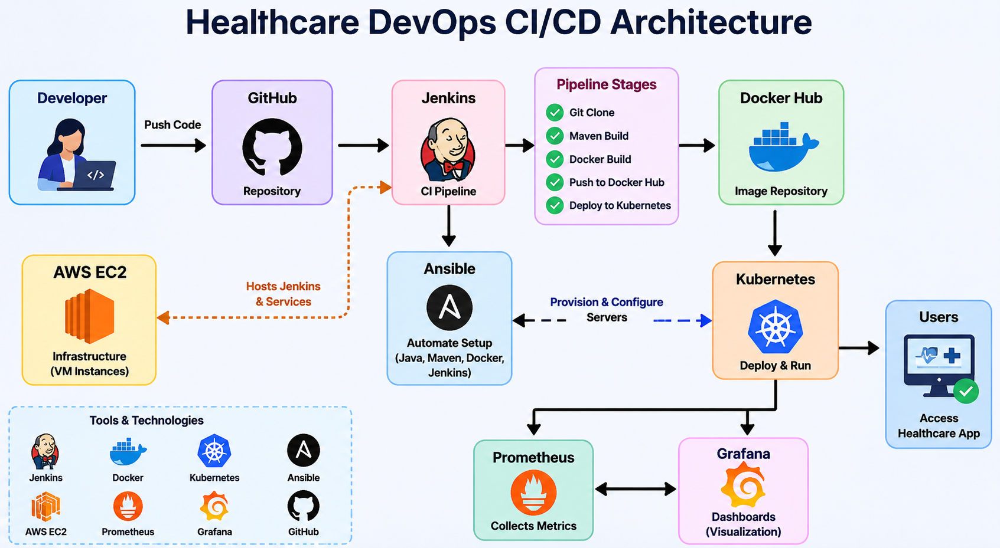
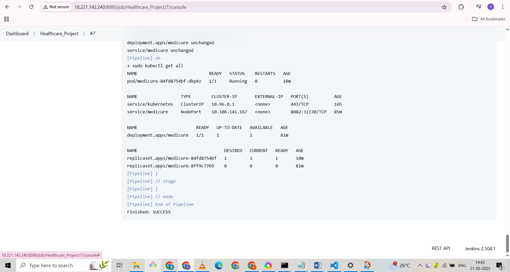
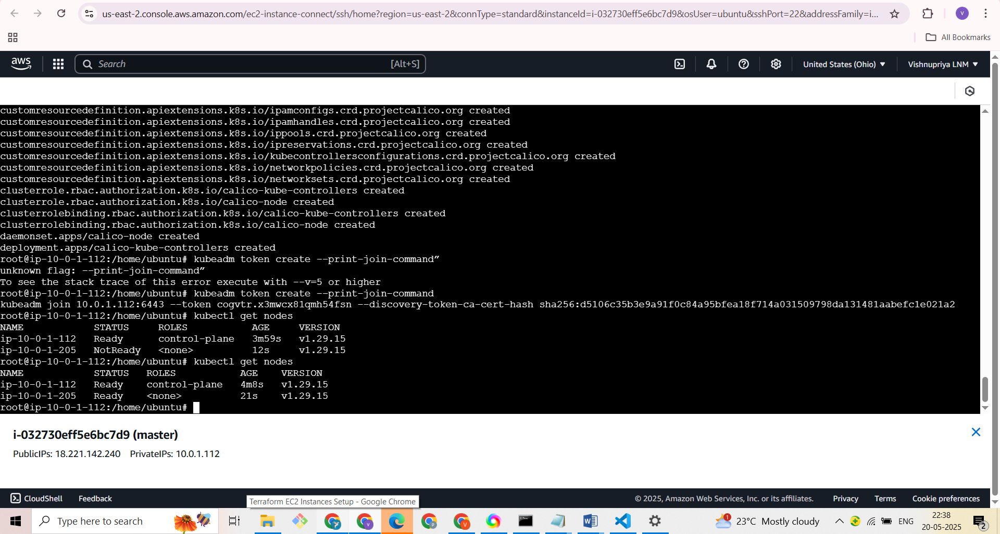
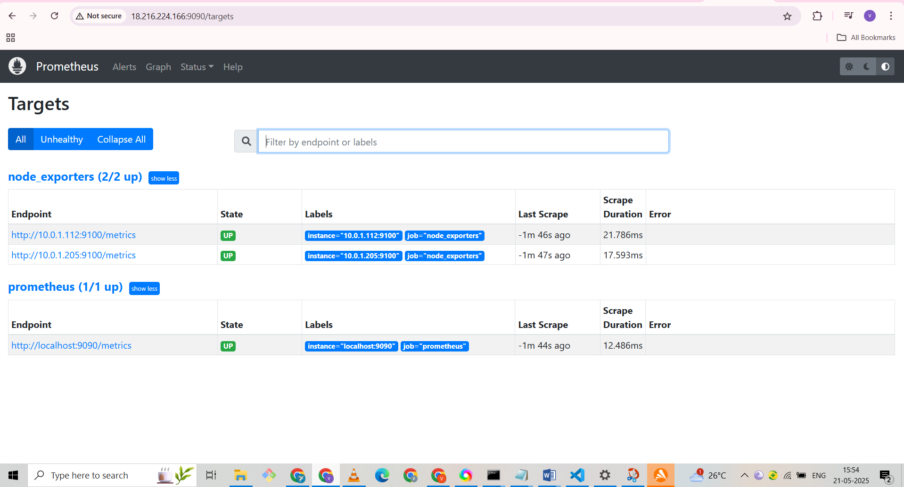
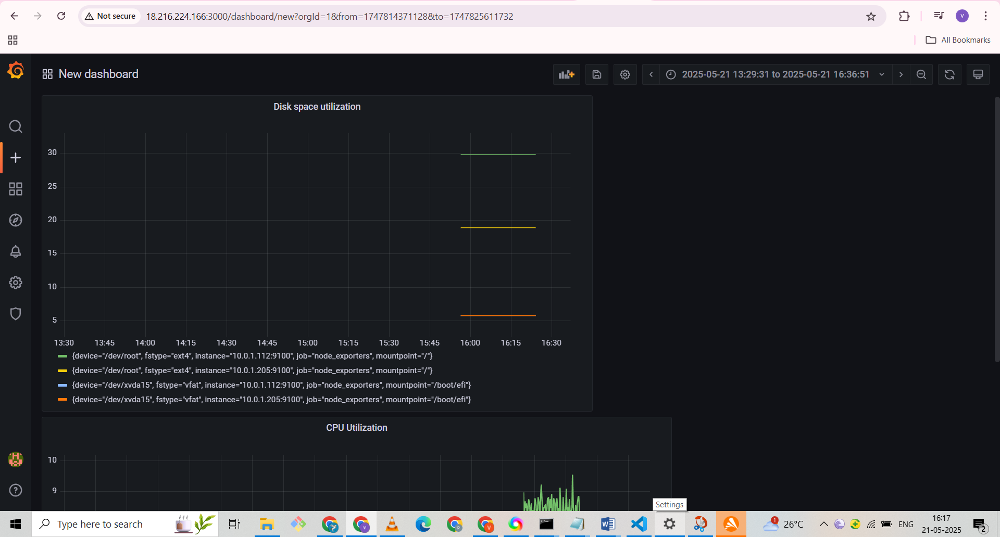

# Healthcare DevOps CI/CD Project

End-to-end DevOps implementation for deploying a healthcare application using Jenkins, Docker, Kubernetes, AWS, Ansible, Prometheus and Grafana.

## Project Overview

This project demonstrates a complete CI/CD pipeline where code is built, containerized, deployed to Kubernetes, and monitored using Prometheus and Grafana.

## Tools Used

* Jenkins
* Docker
* Kubernetes
* AWS EC2
* Ansible
* Prometheus
* Grafana
* GitHub
* Maven

## Architecture

GitHub → Jenkins → Maven Build → Docker → Docker Hub → Kubernetes → Prometheus → Grafana

## Workflow

1. Source code pushed to GitHub
2. Jenkins pipeline triggered
3. Maven builds the application
4. Docker image created and pushed to Docker Hub
5. Kubernetes deploys application
6. Prometheus collects metrics
7. Grafana visualizes monitoring dashboards

## Screenshots
### Architecture

### Jenkins Pipeline

### Kubernetes Deployment

### Prometheus Monitoring

### Grafana Dashboard

## Troubleshooting

### Jenkins Build Failure

* Checked Jenkins console logs
* Verified Maven dependencies
* Fixed configuration issues

### Kubernetes Pod Failure

Commands used:

kubectl get pods

kubectl describe pod <pod-name>

kubectl logs <pod-name>

### Monitoring Issue

* Verified Prometheus targets
* Verified node_exporter running
* Checked Grafana datasource configuration
